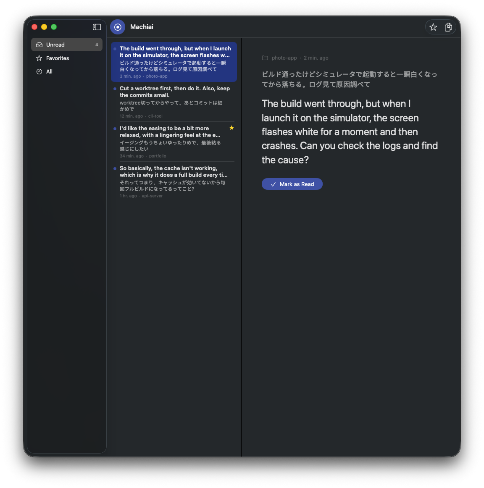

# Machiai

**Turn the wait for your AI coding agent into English practice — with the words you just typed.**

[日本語](#日本語) · MIT License · macOS 15+



You type a prompt to Claude Code in your own language and wait while it thinks.
Machiai uses that wait. In the background it translates **what you just said** into natural
English and puts it in a small reading app. Press Cmd+Tab, read how you would have said it,
check it off, and go back to the terminal.

- **Your own words are the best study material.** You know what you meant, you care about it,
  and you will say something similar again tomorrow.
- **Never slows the agent down.** The hook returns in a fraction of a second; translation runs detached.
  Claude's reply never waits for Machiai.
- **Never steals focus.** New items only update the Dock badge. You go to Machiai when you want to.
- **Read → check → back to work.** Checking an item moves to the next one. When the inbox is empty
  Machiai hides itself and your terminal is in front again.
- **Favorites** keep the phrases worth remembering.

> *Machiai* (待合) means "waiting room" in Japanese.

## How it works

```
Claude Code ──UserPromptSubmit──▶ machiai-hook.sh ──▶ inbox/<id>.json (pending)
                                        └─ detached: translate.sh ──▶ inbox/<id>.json (done)
                                                                            │
                                                          Machiai.app watches the inbox
```

1. A Claude Code `UserPromptSubmit` hook writes your prompt to
   `~/Library/Application Support/Machiai/inbox/` and returns immediately.
2. A detached job translates it with your own `claude` CLI (`claude -p --model sonnet`) and
   updates the file.
3. The app shows the entry right away with a "Translating…" indicator and swaps in the
   translation when it arrives.

Prompts that are slash commands (`/…`), shell passthrough (`!…`), plain ASCII (already English),
or very long (pasted logs) are skipped.

## Requirements

- macOS 15 or later (uses the system `/usr/bin/jq`)
- [Claude Code](https://docs.claude.com/en/docs/claude-code) logged in (subscription or API key)
- To build: Xcode 16+ and [Tuist](https://tuist.dev) (`brew install tuist` or `mise install`)

## Install

### Build from source

```bash
git clone https://github.com/ohzono/machiai.git
cd machiai
scripts/build-release.sh          # builds build/Machiai.app (ad-hoc signed)
cp -R build/Machiai.app /Applications/
```

### Connect Claude Code

Open Machiai → **Settings → Install for Claude Code**, or run:

```bash
"/Applications/Machiai.app/Contents/Resources/hooks/install.sh"
```

The installer copies the hook to `~/Library/Application Support/Machiai/hooks/`, adds one
`UserPromptSubmit` entry to `~/.claude/settings.json` (backup first, symlinks respected,
re-running is a no-op) and turns capture on. New Claude Code sessions pick it up.

Prefer to edit settings yourself? `install.sh --print` prints the snippet.
Remove it with `install.sh --uninstall`.

## Using it

| Action | Shortcut |
|---|---|
| Mark as read (and go to the next unread) | ⌘↩ |
| Favorite | ⌘D |
| Copy translation | ⇧⌘C |
| Mark as unread | ⇧⌘U |
| Delete | ⌘⌫ |
| Bigger / smaller / default text | ⌘+ / ⌘− / ⌘0 |

Toggle **Capture** in the toolbar or the app menu to pause without uninstalling.

## Configuration

Settings are written to `~/Library/Application Support/Machiai/config.env`, which the hook reads:

| Key | Default | Meaning |
|---|---|---|
| `MACHIAI_MODEL` | `sonnet` | Model passed to `claude -p` |
| `MACHIAI_TARGET_LANG` | `English` | Language to translate into |
| `MACHIAI_MAX_CHARS` | `1200` | Longer prompts are skipped |
| `MACHIAI_TRANSLATE_CMD` | *(unset)* | Use any other translator (see below) |

### Bring your own translator

`MACHIAI_TRANSLATE_CMD` is run with `sh -c`; it receives the source text on stdin and must print
only the translation. For example, a local model with [Ollama](https://ollama.com):

```bash
MACHIAI_TRANSLATE_CMD='ollama run llama3.2 "Translate this into natural English. Output only the translation:"'
```

## Other agents

The hook ↔ app boundary is a documented file drop, so anything that writes this JSON to the inbox
works (Codex, Gemini CLI, your own scripts). Write to a dotfile in the same directory, then `mv`
it into place; rewrite the same `id` when the status changes.

```json
{
  "version": 1,
  "id": "5B1F0C9E-3D0A-4E0B-9F43-9A1E2C9B7A10",
  "status": "pending",
  "agent": "codex",
  "created_at": "2026-09-23T10:15:30Z",
  "source_text": "ビルドが遅い原因を調べて",
  "translation": null
}
```

`status` is `pending`, `done` or `failed`. Full contract: [docs/SPEC.md §4.2](docs/SPEC.md).

## Privacy

Everything stays on your Mac. Prompts are sent only to the translator you configure — by default
your own `claude` CLI, under your existing account. Machiai has no server and no telemetry.

## Development

See [AGENTS.md](AGENTS.md) for build commands and the invariants that must hold, and
[docs/SPEC.md](docs/SPEC.md) for the spec.

```bash
tests/hook_test.sh
tuist generate --no-open
xcodebuild test -workspace Machiai.xcworkspace -scheme Machiai -destination 'platform=macOS'
```

## License

MIT

---

## 日本語

**AI エージェントの待ち時間を、自分がいま打った言葉で英語を学ぶ時間に。**

Claude Code に日本語で指示を出して待っている間に、Machiai が**その指示文**を自然な英語に訳して、
小さな読書アプリに届けます。Cmd+Tab で開いて読み、チェックを付けたらターミナルに戻る。
それだけです。

- **自分の言葉だから覚えやすい**: 何を言いたかったか分かっていて、明日もまた似たことを言う
- **エージェントを待たせない**: hook は1秒もかからず抜け、翻訳は裏で走る
- **フォーカスを奪わない**: 新着は Dock バッジだけ
- **読んだらチェック → 次へ**: 全部読むと Machiai は自動で隠れ、ターミナルが前面に戻る
- **お気に入り**: 覚えたい言い回しを残せる

セットアップは上の [Install](#install) を参照してください（アプリの **設定 → Claude Code に
インストール** からも行えます）。翻訳は既定であなた自身の `claude` CLI（sonnet）を使い、
データはすべて Mac 内に留まります。
